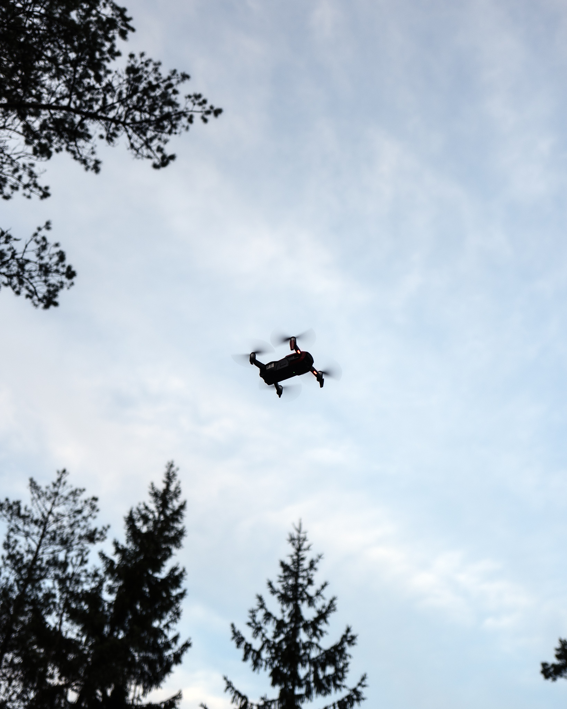
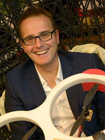

<!-- Main -->

<!-- One -->
<section id="one">
	

	

		

The <strong>Interdisciplinary Workshop on Human-Drone Interaction (iHDI 2020)</strong> &ndash; part of the <a href="https://chi2020.acm.org/">2020 CHI Conference on Human Factors in Computing Systems (CHI '20)</a> &ndash; is a gathering for scholars of <em>human-drone interaction (HDI)</em> and related subjects.

<strong>Human-drone interaction (HDI)</strong> is becoming an ubiquitous topic in daily life, and a rising research topic within CHI. Knowledge from many disciplines &ndash; design, engineering, social sciences, humanities... &ndash; can inform the design and study of HDI, making interdisciplinary communication essential. <strong>iHDI 2020</strong> aims to bring together diverse perspectives, advancing HDI and its scholarship through discussions and activities involving an assortment of research and design approaches. The workshop intends to serve as a platform for an enduring community, towards results that <em>take off</em>.

<header class="major">
<h3>Important Dates and Links</h3>
</header>
				
<ul>
	<li>
		<strong>11 February 2020:</strong> Submissions due
			<ul style="margin-bottom: 0;">
				<li>Submit at: <a href="#">TBA</a></li>
				<li>Submission format: <a href="https://chi2020.acm.org/authors/chi-proceedings-format/">CHI Extended Abstracts Format</a></li>
			</ul>
	</li>
	<li><strong>28 February 2020:</strong> Authors notified of acceptance</li>
	<li>
		<strong>25 April 2020:</strong> Proceedings published
		<ul style="margin-bottom: 0;">
			<li>Proceedings hosted at: <a href="#">TBA</a></li>
		</ul>
	</li>
	<li><strong>25/26 April 2020:</strong> Workshop</li>
</ul>

 <!-- .row -->

	

</section>

<!-- Two -->
<section id="two" class="spotlights">
	<section>
		
		

			

		
<header class="major">
<h3>Call for Papers</h3>
</header>

	

		

Drones are becoming ubiquitous. Current applications include logistics, construction, security, emergencies, and photography. Emerging applications like exercise, companionship, and tangible user interfaces are active research topics within the CHI community.

				

Knowledge from a wealth of disciplines can inform new drone applications; and communication between different disciplines (design, engineering, social sciences, humanities...) is essential. To this end, the <strong>Interdisciplinary Workshop on Human-Drone Interaction (iHDI 2020)</strong> aims to intertwine diverse perspectives, as a platform for researchers and practitioners learning from each other.

	

We seek high quality contributions exploring HDI from a plethora of perspectives, including but not limited to: empirical research, engineering, design, theory, art, and opinions.

Examples for topics include, but are not limited to, the following:

<ul>
<li>Novel HDI experiences</li>
<li>Theoretical and philosophical arguments on concepts and contexts</li>
<li>Transferring learnings between HDI and other HCI or extracurricular topics</li>
<li>Policy and regulatory issues</li>
<li>Accessible HDI</li>
<li>Prototyping and development tools</li>
<li>Ethnographic fieldwork with users, developers, and bystanders</li>
</ul>

The submission deadline is 11 February 2020. Authors are invited to submit position papers, up to 6 pages (including references) in the <a href="https://chi2020.acm.org/authors/chi-proceedings-format/">CHI Extended Abstracts Format</a>, at: <a href="https://easychair.org/conferences/?conf=ihdi2020">easychair.org/conferences/?conf=ihdi2020</a>

The proceedings will be stored on the open archive <a href="https://hal.archives-ouvertes.fr/">HAL</a>, indexed by Google Scholar. A paper on workshop outcomes will be submitted to a relevant venue. Selected contributions will be considered for publication in a special issue of the <a href="https://thri.acm.org/">THRI</a> journal.

At least one author must attend. Attendees must register for the workshop and at least one day of CHI 2020.

Workshop website: <a href="https://socialdrones.github.io/ihdi2020/">socialdrones.github.io/ihdi2020/</a>

					
<ul class="actions">
<li><a href="https://easychair.org/conferences/?conf=ihdi2020" class="button">Submit</a></li>
</ul>

<!-- .row -->
			

		

	</section>
	<section>
		
		

			

	

		
<header class="major">
<h3>Workshop Program*</h3>
</header>
				
<ul>
	<li><strong>15 min</strong> Opening</li>
	<li><strong>15 min</strong> Introduction and Ice-breaking</li>
</ul>
<ul>
	<li><strong>20 min</strong> Keynote</li>
	<li><strong>100 min</strong> Presentations and Posters</li>
	<li><strong>30 min</strong> Break</li>
</ul>
<ul>
	<li><strong>120 min</strong> Prototyping Activities</li>
	<li><strong>20 min</strong> Break</li>
</ul>
<ul>
	<li><strong>40 min</strong> Prototype Presentations and Discussin</li>
	<li><strong>30 min</strong> Summary and Closing</li>
</ul>
<ul>
	<li><strong>Afterwards</strong> Dinner and Networking</li>
</ul>

<small>* Tentative</small>

<header class="major">
<h3>Post-Workshop Plans</h3>
</header>
				

Workshop papers will be stored on the open archive <a href="https://hal.archives-ouvertes.fr/">HAL</a> (indexed by Google Scholar). Papers will also be listed here on the workshop website, with links to the HAL reposiory. A brief report on workshop activities, as well as selected photos and descriptions of outputs from the hands-on session (subject to creators’ permissions) will be published here on the workshop website. We also aim to explore other online platforms for continuous knowledge sharing, based on the preferences of the community. 

A variety of post-workshop academic publications will beconsidered based on the content of the accepted submissions and the outputs of workshop sessions. These include but are not limited to: a report to be submitted to a venue that is relevant to the CHI community (e.g. <a href="https://interactions.acm.org/">ACM Interactions</a>), full paper submissions to relevant SIGCHI conferences based on synergies between research efforts presented at the workshop, and scoping a special issue of ajournal based on research agendas articulated at the workshop. (The editors-in-chief of <a href="https://thri.acm.org/">ACM THRI</a>have been contacted regarding a HDI special issue.)

 <!-- .row -->
			

	
<!--
<ul class="actions">
<li><a href="generic.html" class="button">Learn more</a></li>
</ul>
-->
			

		

	</section>
	<section>
		
		

			

			
<header class="major">
	<h3>Proceedings</h3>
</header>

TBA

				
			

		

	</section>
</section>

<section>
	

		
<header class="major">
<h2>Organizers</h2>
</header>

	

<strong>Mehmet Aydın Baytaş</strong> completed his PhD within Koç University's interdisciplinary Design, Technology and Society program. He is a Marie Skłodowska-Curie Research Fellow at Qualisys AB, and a research affiliate at Chalmers University of Technology's t2i Lab. His current research addresses the design space of autonomous drones operating in human-populated environments.

<strong>Markus Funk</strong> is a senior user experience researcher at Cerence. Inc, Germany. Markus is an expert in human-drone interaction and flying user interfaces.

<strong>Sara Ljungblad</strong> is an Assistant Professor at the University of Gothenburg and Chalmers University of Technology. She is interested in inclusive design methods and has done several long-term studies understand experiences of robotic products in everyday settings. She is currently funded by <a href="https://wasp-hs.org/projects/the-rise-of-social-drones-a-constructive-design-research-agenda/">WASP-HS</a> to conduct constructive and critical design research on "social drones."

<strong>Jérémie Garcia</strong> is an Assistant Professor at ENAC, Toulouse, France. He is interested in designing interactions to author and operate automated systems including drones and air traffic control.

<strong>Joseph La Delfa</strong> is a PhD student in the School of Design at RMIT University. His research is focused on bodily awareness and reflection through HDI. His experiences in product design and engineering, from concept to production and maintenance, covers industries including glassware, hand tools, furniture, and service design.

<strong>Florian 'Floyd' Mueller</strong> is a Professor at RMIT University, where he directs the <a href="https://exertiongameslab.org/">Exertion Games Lab</a>. His research straddles the intersection of human-computer interaction, the body, and gaming; including the use of drones in exercise and recreation.

<header class="major">
<h2>Past Related Workshops</h2>
</header>

<ul>
<li><a href="http://hdi.famnit.upr.si/"><em>iHDI: First International Workshop on Human-Drone Interaction</em> at ACM CHI 2019</a></li>
<li><a href="https://www.iri.upc.edu/workshops/hriuav18/"><em>Human-Robot Interaction with UAVs: Challenges and Frontiers</em> at IEEE ICRA 2018</a></li>
<li><a href="http://cse.unl.edu/~bduncan/rss/index.html"><em>Human-Robot Interaction for Small and Personal Unmanned Aerial Vehicles</em> at RSS 2016</a></li>
</ul>

<!--
<ul class="actions">
<li><a href="generic.html" class="button next">Get Started</a></li>
</ul>
-->
	

</section>

